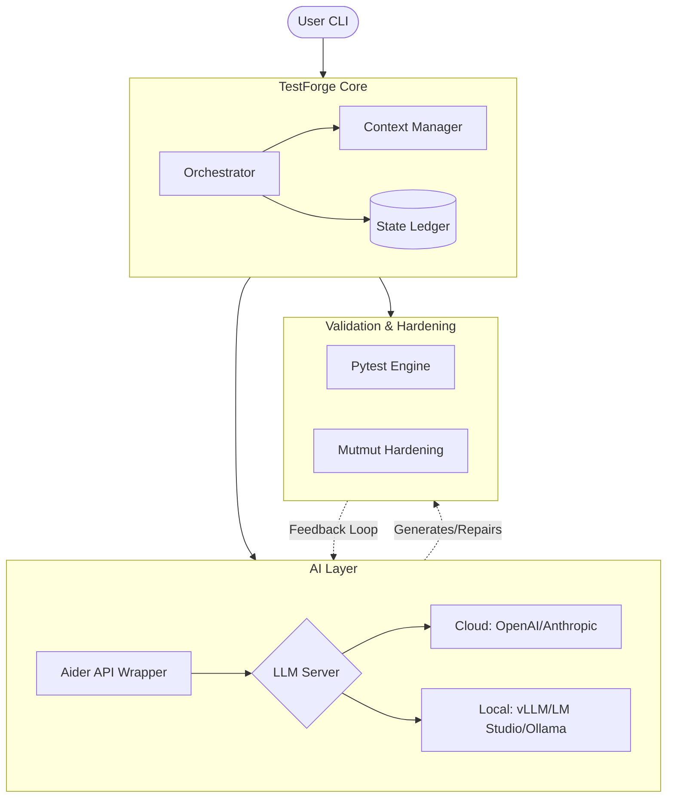
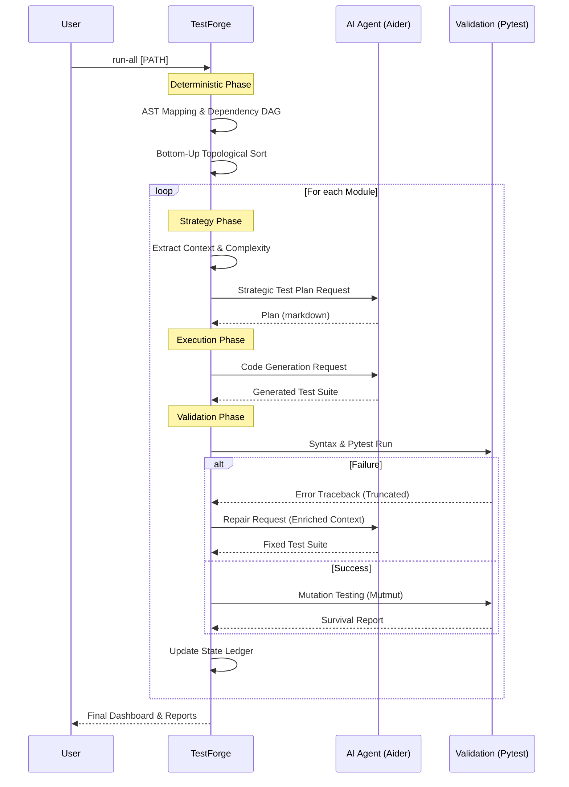

# System Architecture 🏗️

TestForge is engineered as a high-integrity bridge between **Deterministic Static Analysis** and **Agentic AI**. It treats AI not as an autonomous author, but as a specialized engine guided by strict scientific constraints and a deterministic pipeline.

---

## High-Level System Components

The following diagram illustrates how TestForge orchestrates the interaction between the user, the AI agent layer, and the validation engine.

---

## Execution Data Flow

TestForge follows a strict **Research -> Plan -> Execute -> Validate** lifecycle. This sequence ensures that every line of code generated is grounded in the actual architecture of your project.

---

## Core Components

### 1. TestForge Core Engine
The "Brain" of the operation. It handles the heavy lifting of understanding your code without using AI tokens.
*   **Orchestrator**: Manages the pipeline lifecycle, concurrency, and error handling.
*   **Context Manager**: Uses `libcst` and `ast` to map the codebase, calculate McCabe complexity, and build the Dependency DAG.
*   **State Ledger**: A persistent JSON-based checkpointing system that allows the pipeline to pause, resume, and skip already-validated modules.

### 2. AI Agent Layer (Aider)
We utilize **Aider** as our primary agentic engine. Aider provides a robust API for applying multi-file edits and maintaining a coherent "chat" context with the LLM. TestForge enriches Aider's prompts with deterministic data (like the architecture map and BVA requirements) to minimize hallucinations.

### 3. Validation Layer
A test is only valid if it survives the fire of execution.
*   **Pytest**: Runs the generated tests. TestForge captures and "smart-truncates" the output to keep repair prompts dense and cost-efficient.
*   **Mutmut**: Injects "mutants" (intentional bugs) into your source code to verify that the generated tests actually fail when the logic changes.

---

## Deployment & Privacy Models

TestForge is model-agnostic. You can choose the infrastructure that fits your security requirements:

| Component | Cloud-First (SaaS) | Local-First (Private) |
| :--- | :--- | :--- |
| **Logic Engine** | Local Machine | Local Machine |
| **AI Inference** | OpenAI / Anthropic | vLLM / LM Studio / Ollama |
| **API Protocol** | HTTPS (Encrypted) | Localhost (No Data Leaves) |
| **Performance** | High Reasoning | High Privacy / Zero Cost |

!!! tip "Hybrid Strategy"
    Many users use a fast local model (like `Qwen-2.5-Coder`) for the **Mapping Phase** and a heavy cloud model (like `o1-preview` or `gpt-4o`) for the **Strategic Planning Phase**.
