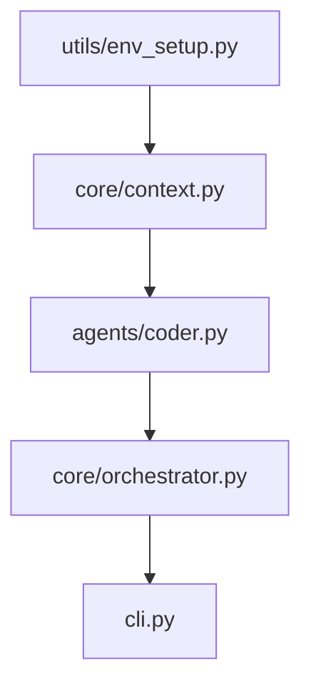

# Scientific Core & Methodology 🔬

TestForge is built on rigorous computer science principles to ensure that AI-generated tests are not just "hallucinations" of code, but valid engineering artifacts.

---

## 1. Intelligent Module Filtering
**The Problem**: Codebases are often cluttered with utility files, empty `__init__.py` modules, or data-only files that don't contain testable logic. Sending these to an LLM wastes tokens and generates noisy, low-value tests.

**The Solution**: TestForge employs a deterministic **AST Heuristic** to identify "testable" modules.

!!! info "Under the Hood: Filtering Logic"
    When the Orchestrator scans your project, it invokes `ContextManager.analyze_file()` which uses the following logic:
    1.  **AST Parsing**: The file is parsed into an Abstract Syntax Tree using `ast`.
    2.  **Symbol Extraction**: We count the number of `ClassDef` and `FunctionDef` nodes.
    3.  **Testability Flag**: A module is marked `is_testable = True` **only if** it contains at least one class or one function.
    4.  **Skipping**: Files like empty `__init__.py` or global constant files are automatically identified as `is_testable = False` and moved to the "Skipped" list in the pipeline output.

---

## 2. Topological Dependency Resolution
**The Problem**: Testing a high-level module (e.g., a CLI wrapper) before its core logic dependencies leads to "context bloat" and circular reasoning in AI prompts.

**The Solution**: TestForge builds a Directed Acyclic Graph (DAG) of your entire codebase.

!!! info "Under the Hood: Graph Resolution"
    1.  **Import Scanning**: We use AST to extract all internal `import` and `from ... import` statements.
    2.  **DAG Construction**: Using `networkx`, we map every module as a node and every import as a directed edge (dependency -> dependent).
    3.  **Bottom-Up Sort**: We apply a **Topological Sort**. This ensures that "leaf" modules (those with 0 dependencies) are processed first.
    4.  **Verified Context**: By the time the AI reaches a high-level module, its dependencies have already been "validated" by the pipeline.

---

## 3. McCabe Cyclomatic Complexity
**The Problem**: Simple "getter" methods don't require the same level of architectural rigor as complex nested algorithms.

**The Solution**: We calculate the complexity score ($M = E - N + 2P$) for every symbol.

!!! info "Under the Hood: Complexity Calculation"
    TestForge calculates complexity during the deterministic analysis phase:
    *   **Base Score**: Every function starts with a complexity of 1.
    *   **Decision Points**: We increment the score for every `if`, `while`, `for`, `and`, `or`, and `except` block found in the AST.
    *   **Risk Prioritization**: High-complexity modules are flagged in the `execution_plan.yaml` and the AI is explicitly prompted to use **Boundary Value Analysis** to cover every logical branch.

---

## 4. Boundary Value Analysis (BVA) & DSE Simulation
**The Problem**: AI often generates "happy path" inputs and misses edge cases (e.g., empty lists, `None` values, or integer overflows).

**The Solution**: TestForge forces the AI to simulate a **Dynamic Symbolic Execution (DSE)** engine.

*   **Equivalence Partitioning**: The AI must define "Safe," "Boundary," and "Illegal" input ranges.
*   **Simulated Execution**: The prompt template (`plan_tests.j2`) requires the AI to trace every logical path identified in the McCabe analysis and design inputs that specifically trigger those paths.

---

## 5. Context-Efficient Smart Validation
**The Problem**: Iterative repair cycles can lead to "Context Explosion." Feeding large tracebacks or the entire codebase into an LLM repeatedly causes high costs, slow responses, and increased hallucination rates.

**The Solution**: TestForge implements a multi-stage **Smart Validation Pipeline**.

!!! info "Under the Hood: Smart Repair Logic"
    1.  **Syntax Pre-validation**: We run a static syntax check using `ast.parse()` on every generated test. If a syntax error is found, we bypass the heavy `pytest` execution and immediately task the AI with fixing the code structure.
    2.  **Smart Error Truncation**: When tests fail, we don't send the full raw output. Our regex-based parser extracts only the `FAILURES`, `ERRORS`, and `short test summary info` sections. If the output is still too large, it is truncated from the middle to preserve the most critical failure signals.
    3.  **Enriched Context Isolation**: During repair, we initialize a focused AI context containing only the target module source, the original test plan, and the system architecture map. This prevents the agent from losing sight of the engineering intent or getting lost in unrelated dependencies.

---

## 6. Mutation-Guided Hardening
**The Problem**: 100% line coverage is a "vanity metric." You can execute a line without actually asserting its behavior is correct.

**The Solution**: We use **Fault Injection** via `mutmut` to prove test rigor.

!!! danger "The Mutant Test"
    1.  **Injection**: `mutmut` modifies your source code (e.g., changing `>` to `>=`).
    2.  **Execution**: Your generated tests are run against the "mutant."
    3.  **Survival Check**: If the tests still pass, the mutant "survived," meaning your assertions are weak.
    4.  **Autonomous Healing**: TestForge identifies the survival, feeds the mutant type back to the AI, and demands a stronger assertion to "kill" it.
